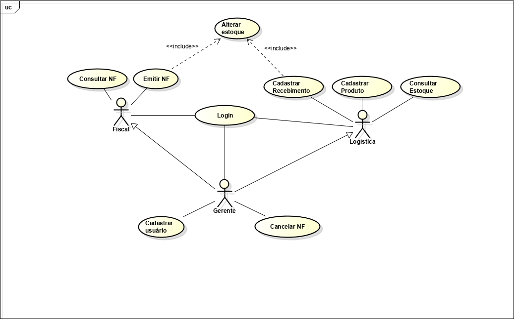
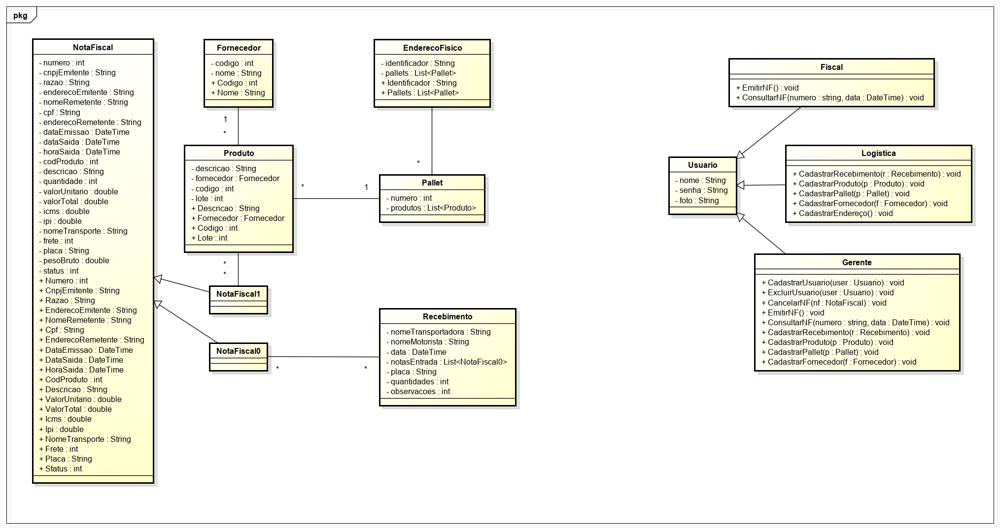

# Controle de Estoque

## 1. Introdução

### 1.1. Descrição do projeto

A finalidade desse documento, é montar uma analise do problema a ser resolvido, para que o desenvolvimento do
produto, o professor que está a avaliar o produto criado nessa atividade acadêmica e os demais que venham ver o produto final tenha uma melhor noção do que é, como funciona e o qual problema estamos resolvendo. Além disso o projeto tem o intuito de nos propiciar a experiência de trabalho em equipe, o manuseio de P.O.O. em uma aplicação real e a manipulação de WPS no visual studio 2017 juntamente com a experiência de manipular dados de um banco de dados simples.

## 2. Posicionamento

### 2.1. Descrição do problema

Uma empresa está necessitando de um programa que gerencie a entrada e saída de produtos em estoque, bem como, organizá-los. É necessário que estejam dispostos as seguintes funções no sistema: quantidade e informações acerca dos produtos(fornecedor e descrição) em estoque; gerenciamento do recebimento de mercadoria (conhecimento de carga); emissão de Nota Fiscal de saída (NF); cadastro de novos produtos; cadastro de usuários e verificação de status da nota fiscal(alteração e cancelamento). Os usuários da aplicação estão divididos por uma hierarquia de cargos, sendo eles, Gerente (administrador do sistema), setor fiscal e de logística.

## 3. Envolvidos e Tecnologias

### 3.1. Lista de envolvidos

* Gerente (Administrador do sistema)
* Setor fiscal
* Setor de logística

### 3.2. Tecnologias usadas

* Banco de dados SQL Server
* C#, Visual Studio, WPS

## 4. Requisitos do produto

* Escolher nível de manipulação da aplicação
* Cadastrar produtos
* Emitir nota fiscal
* Verificar status da nota fiscal
* Modificar dados na nota fiscal e cancelar (somente administrador)
* Cadastrar recebimento de mercadoria
* Cadastrar usuários(fiscal, logística)
* Consultar produtos no estoque

## 5. Diagrama de casos de uso

## 6. Diagrama de classes

## 7. Diagrama de Modelos

